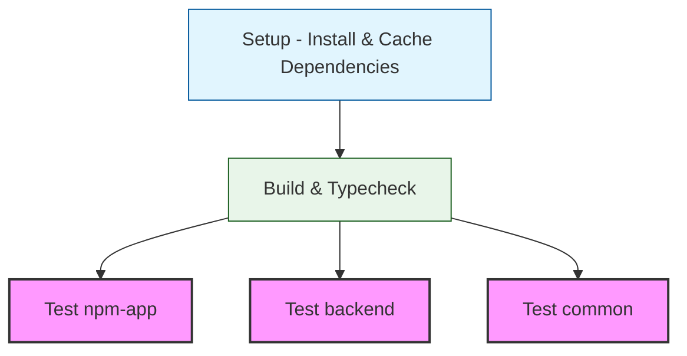

# GitHub Actions Knowledge

## CI/CD Pipeline Overview

The CI pipeline consists of multiple jobs that run in sequence and parallel:



### Key Jobs
- **Setup**: Installs and caches dependencies
- **Build**: Compiles the project and runs typechecking in one combined job
- **Tests**: Three parallel test jobs for different packages:
  - npm-app tests
  - backend tests
  - common tests

### Important Settings
- Uses Bun v1.1.26 for all jobs
- Tests use retry logic (max 5 attempts, 10 min timeout)
- Dependencies are cached between jobs
- Environment variables are set from secrets
- Build and typecheck are combined for efficiency

## Artifact Actions

- Use `actions/upload-artifact@v4` and `actions/download-artifact@v4`
- v3 was deprecated and stopped working on January 30th, 2025
- v4 provides up to 98% faster upload/download speeds
- See [GitHub's migration guide](https://github.com/actions/upload-artifact/blob/main/docs/MIGRATION.md) for breaking changes

## Environment Variables in CI

### GitHub Actions Environment
- Secrets and environment variables are managed through GitHub repository settings
- The workflow uses GitHub secrets for sensitive data
- CI-specific flags (like CODEBUFF_GITHUB_ACTIONS) are set directly in workflow steps

### Local Testing with Act

When running GitHub Actions locally using `act`:

1. **Environment Setup**:
   - `.github/act/bootstrap-act-config.sh` generates:
     - `.actrc`: Docker and artifact settings
     - `.env.act`: Non-secret environment variables
     - `.secrets.act`: Secret environment variables (chmod 600)

2. **File Handling**:
   - `run-local.sh` automatically:
     - Backs up existing `.env.local` before running
     - Restores the backup after completion
   - The CI workflow only writes `CODEBUFF_GITHUB_ACTIONS=true` to `.env.local`
   - Other environment variables come from `.env.act` and `.secrets.act`

3. **Running Act**:
   ```bash
   # Run all jobs
   bun act

   # Run specific job
   bun act -j test-backend

   # List available jobs
   bun act -l

   # Dry run to see what would happen
   bun act -n

   # Verbose output for debugging
   bun act -v
   ```

### Prerequisites
1. Install `act`:
   ```bash
   brew install act  # macOS
   ```
2. Docker must be running
3. Make sure `.github/act/bootstrap-act-config.sh` is executable:
   ```bash
   chmod +x .github/act/bootstrap-act-config.sh
   ```

### Configuration Files
- `.actrc`: Default act flags and settings
- `.env.act`: Non-secret environment variables
- `.secrets.act`: Secret environment variables (chmod 600)
- `.github/actions/setup-job/action.yml`: Reusable setup steps
- `.github/act/run-local.sh`: Helper script for running act

### Important Notes
- First run will be slower as it builds the Docker image
- Subsequent runs are faster due to `--reuse` flag
- The `--bind` flag mounts local directories for file persistence
- Docker should have at least 8GB memory allocated
- `.secrets` file is auto-created from `.env.local` if it doesn't exist

### Troubleshooting
1. If Docker container fails to start:
   - Check Docker memory allocation
   - Ensure Docker daemon is running
   - Use `bun act -v` for verbose output

2. If tests fail with environment issues:
   - Verify `.secrets` file was created correctly
   - Check that `CODEBUFF_GITHUB_ACTIONS=true` is set
   - Ensure all required environment variables are present

3. If Bun commands fail:
   - Check that Bun version in Dockerfile matches CI (1.1.26)
   - Verify Docker image built successfully
   - Try rebuilding the image without cache

### Best Practices
1. Run specific jobs instead of all jobs when possible
2. Use dry run (`-n`) to verify configuration
3. Keep Docker image up to date with CI environment
4. Regularly clean up unused Docker images/containers
5. Version control `.github/actions/` and `.github/act/`
6. Use the retry mechanism for flaky tests
7. Cache dependencies between jobs for faster builds
