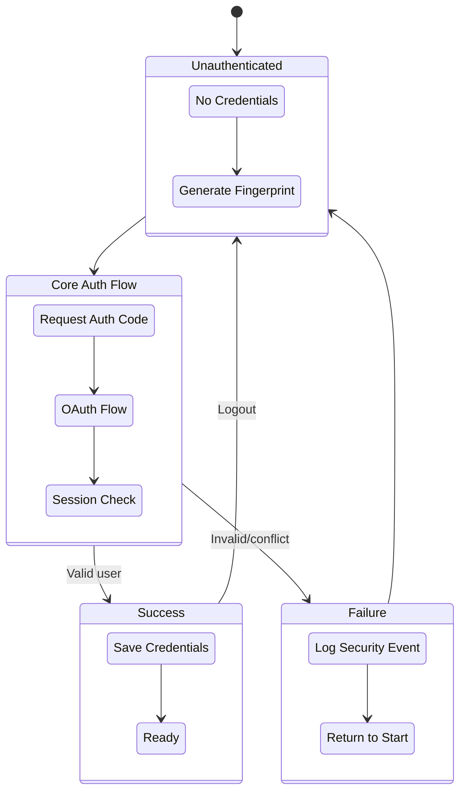
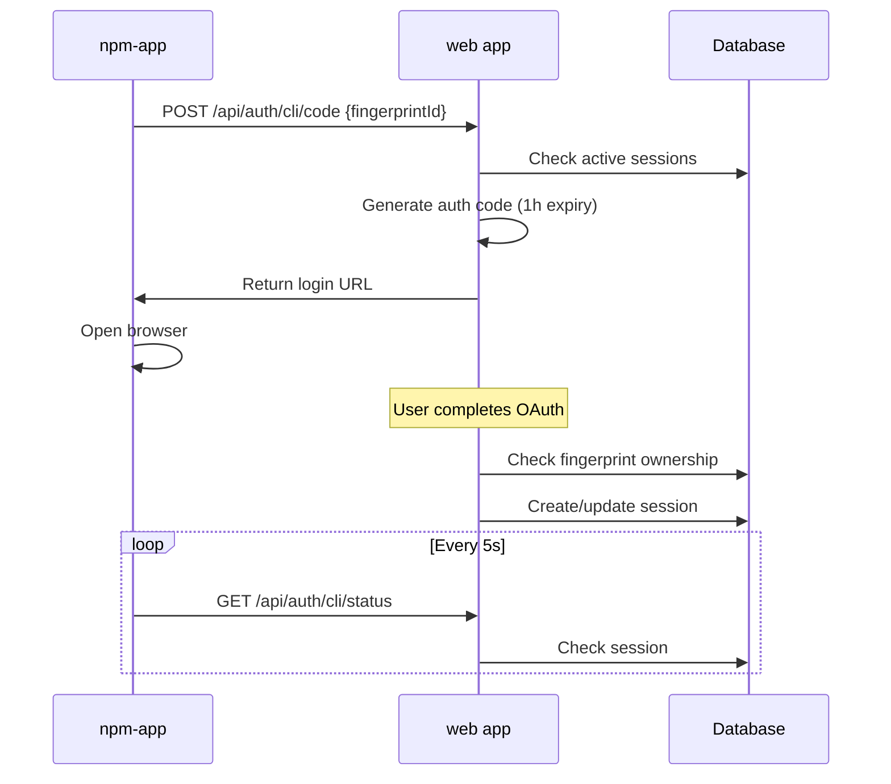
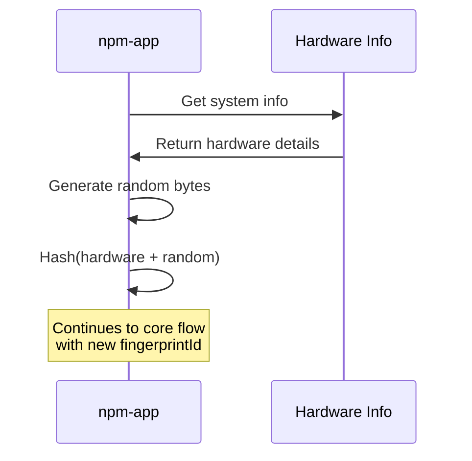
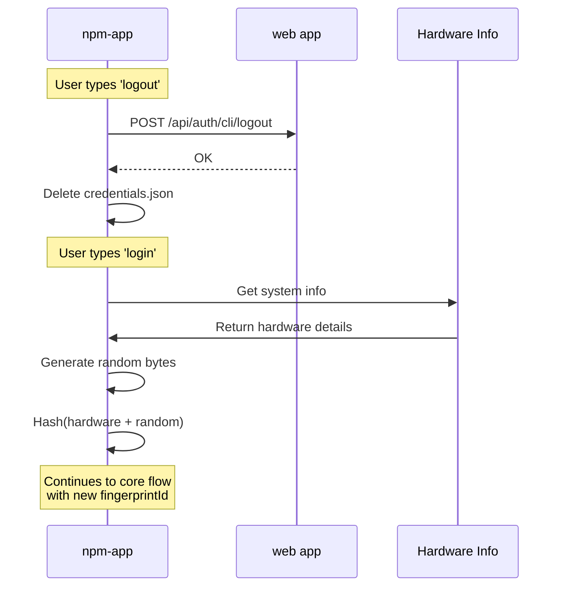
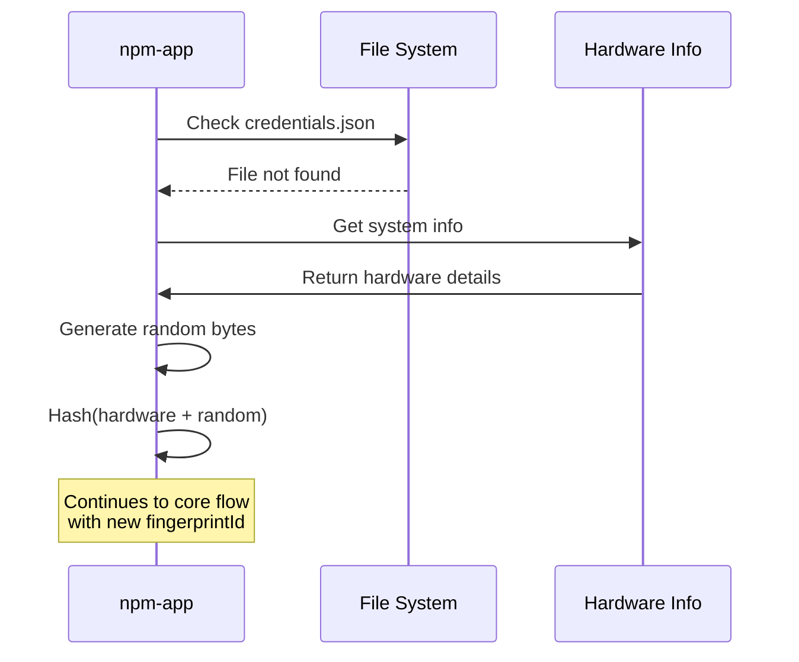
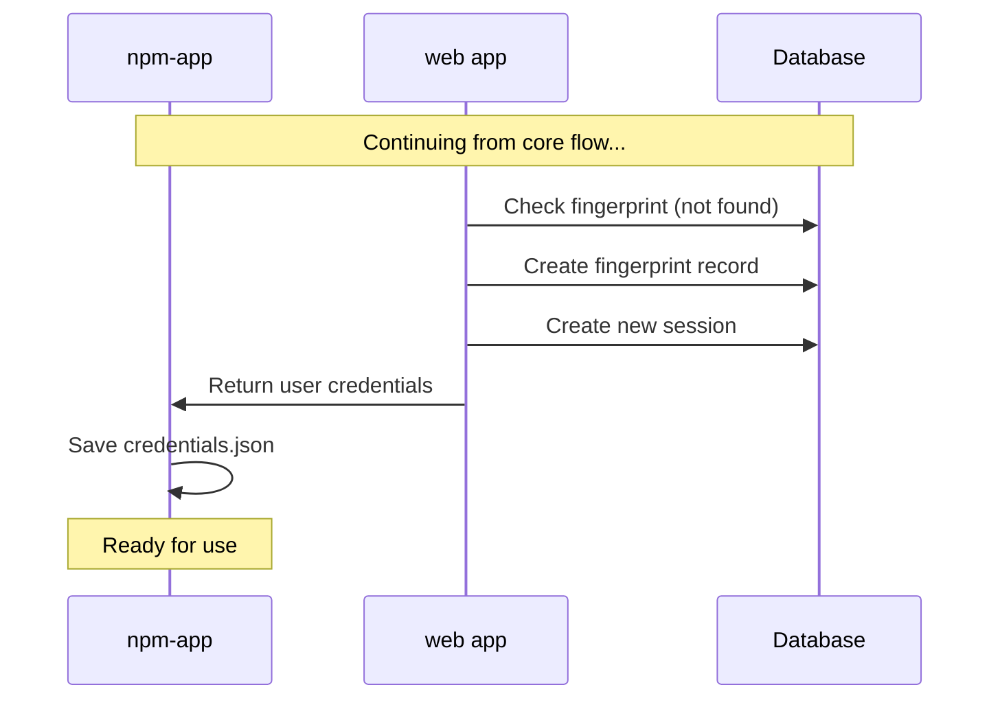
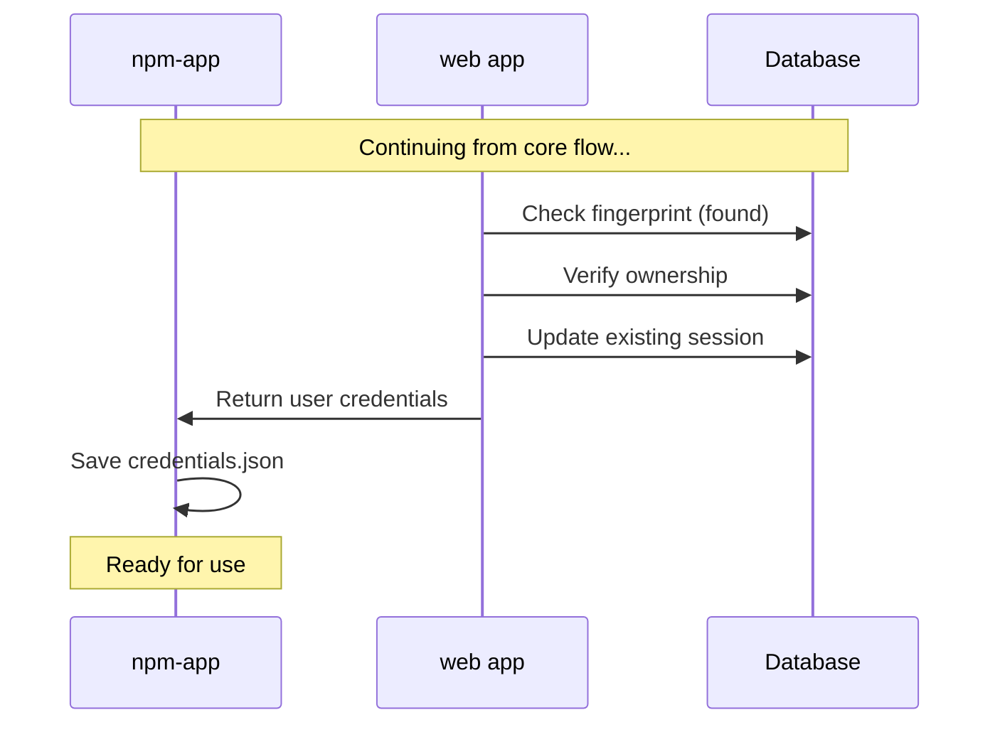
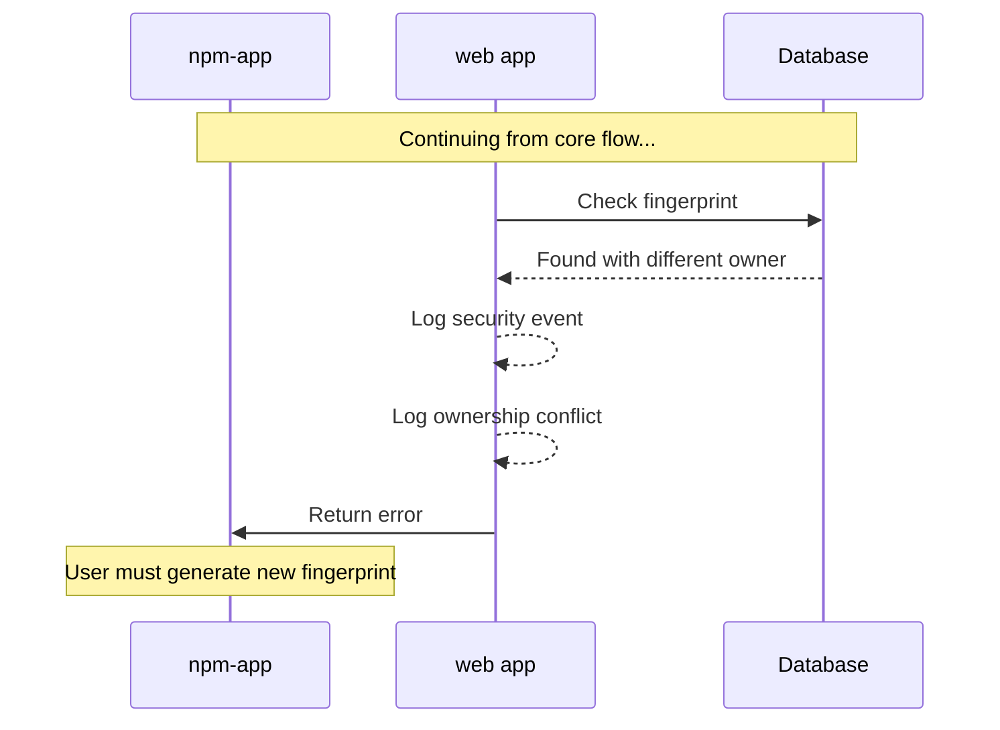
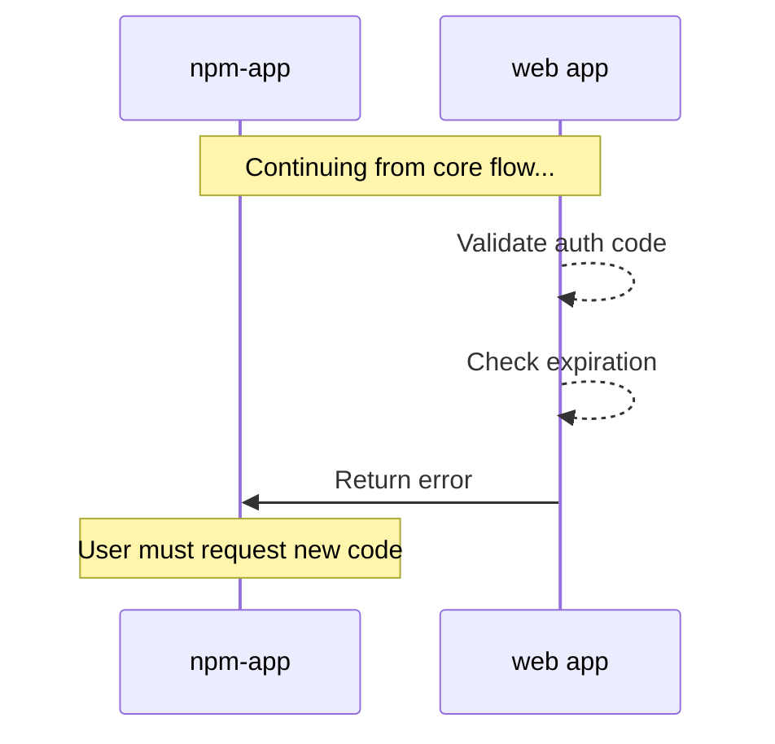

# Authentication Flow for Codebuff

## Overview

Codebuff implements a secure authentication flow between the CLI (npm-app), backend, and web application.

## Lifecycle:

## Core Authentication Flow

This is the common path that all authentication attempts follow:

## Entry Points

### 1. First Time Login

### 2. Logout Flow

### 3. Missing Credentials

## Exit Points

### 1. Success: New Device

### 2. Success: Known Device

### 3. Failure: Ownership Conflict

### 4. Failure: Invalid/Expired Code

## Security Features

- Auth codes expire after 1 hour
- FingerprintIds are unique per device:
  - Hardware info + 8 random bytes ensures uniqueness
  - Attempts by other users are blocked and logged
  - Original user sessions remain secure
- Credentials never stored/transmitted in plain text
- All auth attempts and conflicts logged for monitoring

## Implementation Guidelines

1. Centralize Auth Logic:
   - Keep auth code in one place
   - Handle fingerprint and credentials together
   - Avoid duplicating auth checks

2. Fingerprint Management:
   - Use existing fingerprintId from credentials when available
   - Only generate new ones for first-time users
   - Reference fingerprintId from Client instance (single source of truth)

3. Class Initialization:
   - Initialize auth properties in constructors
   - Use pre-calculated async values with defaults
   - Override defaults with user values if available

4. User Identity:
   - Maintain single source of truth
   - Keep related data with user object
   - Client class owns user state
