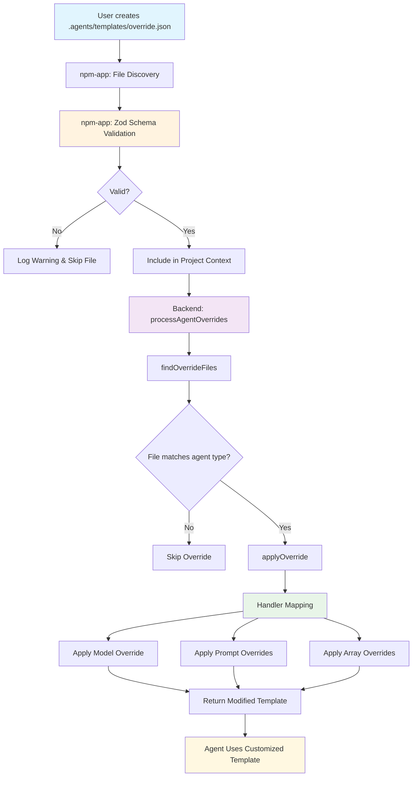

# Backend Knowledge

## Agent System

### Agent Validation

Users can now reference spawnable agents without org prefixes in their agent templates. For example:

- ✅ `"spawnableAgents": ["git-committer", "brainstormer"]`
- ✅ `"spawnableAgents": ["CodebuffAI/git-committer", "brainstormer"]`

Both formats are valid. The validation system in `common/src/util/agent-template-validation.ts` normalizes agent names by stripping the default `CodebuffAI/` prefix during validation, making it user-friendly while maintaining internal consistency.

### Key Files

- `common/src/util/agent-template-validation.ts`: Core validation logic for agent templates
- `backend/src/templates/dynamic-agent-service.ts`: Loads and validates user-defined agents
- `backend/src/templates/agent-registry.ts`: Global registry combining static and dynamic agents
- `common/src/util/agent-name-normalization.ts`: Utilities for normalizing agent names

## Agent Template Override System

The agent template override system allows users to customize agent behavior by placing configuration files in the `.agents/templates/` directory of their project.

### Architecture Flow



### Architecture

- **Location**: Override files are stored in `.agents/templates/` directory
- **File Types**: JSON configuration files (`.json`) and Markdown content files (`.md`)
- **Validation**: All override files are validated using Zod schemas from `@codebuff/common/types/agent-overrides`
- **Processing**: Overrides are applied in file order, with later files taking precedence

### Override Configuration Schema

```typescript
{
  override: {
    type: string,        // e.g., "CodebuffAI/reviewer"
    version: string,     // e.g., "0.1.7" or "latest"
    model?: string,      // Override the model used
    systemPrompt?: {     // Modify system prompt
      type: 'append' | 'prepend' | 'replace',
      path?: string,     // External file path
      content?: string   // Inline content
    },
    userInputPrompt?: { /* same structure */ },
    agentStepPrompt?: { /* same structure */ },
    spawnableAgents?: {  // Modify spawnable agents list
      type: 'append' | 'replace',
      content: string | string[]
    },
    toolNames?: {        // Modify available tools
      type: 'append' | 'replace',
      content: string | string[]
    }
  }
}
```

### Implementation Details

- **File Discovery**: `npm-app` validates override files before sending to backend
- **Type Matching**: Agent type matching uses simple suffix matching (e.g., "CodebuffAI/reviewer" → "reviewer")
- **External Files**: Prompt overrides can reference external `.md` files using relative paths
- **Error Handling**: Invalid files are logged and skipped, falling back to base templates
- **Data-Driven**: Uses handler mapping pattern for maintainable override application

### Usage Example

```json
// .agents/templates/custom-reviewer.json
{
  "override": {
    "type": "CodebuffAI/reviewer",
    "version": "0.1.7",
    "systemPrompt": {
      "type": "append",
      "path": "./custom-review-instructions.md"
    },
    "spawnableAgents": {
      "type": "append",
      "content": ["thinker"]
    }
  }
}
```

This system provides a flexible way for users to customize agent behavior without modifying core code.

## Auto Top-up System

The backend implements automatic credit top-up for users and organizations:

- Triggers when balance falls below configured threshold
- Purchases credits to reach target balance
- Only activates if enabled and configured
- Automatically disables on payment failure
- Grants credits immediately while waiting for Stripe confirmation

Key files:

- `packages/billing/src/auto-topup.ts`: Core auto top-up logic
- `backend/src/websockets/middleware.ts`: Integration with request flow

Middleware checks auto top-up eligibility when users run out of credits. If successful, the action proceeds automatically.

Notifications:

- Success: Send via usage-response with autoTopupAdded field
- Failure: Send via action-error with specific error type
- Both CLI and web UI handle these notifications appropriately

## Billing System

Credits are managed through:

- Local credit grants in database
- Stripe for payment processing
- WebSocket actions for real-time updates

### Transaction Isolation

Critical credit operations use SERIALIZABLE isolation with automatic retries:

- Credit consumption prevents "double spending"
- Monthly resets prevent duplicate grants
- Both retry on serialization failures (error code 40001)
- Helper: `withSerializableTransaction` in `common/src/db/transaction.ts`

Other operations use default isolation (READ COMMITTED).

## WebSocket Middleware System

The middleware stack:

1. Authenticates requests
2. Checks credit balance
3. Handles auto top-up if needed
4. Manages quota resets

Each middleware can allow continuation, return an action, or throw an error.

## Important Constants

Key configuration values are in `common/src/constants.ts`.

## Testing

Run type checks: `bun run --cwd backend typecheck`

For integration tests, change to backend directory to reuse environment variables from `env.mjs`.
