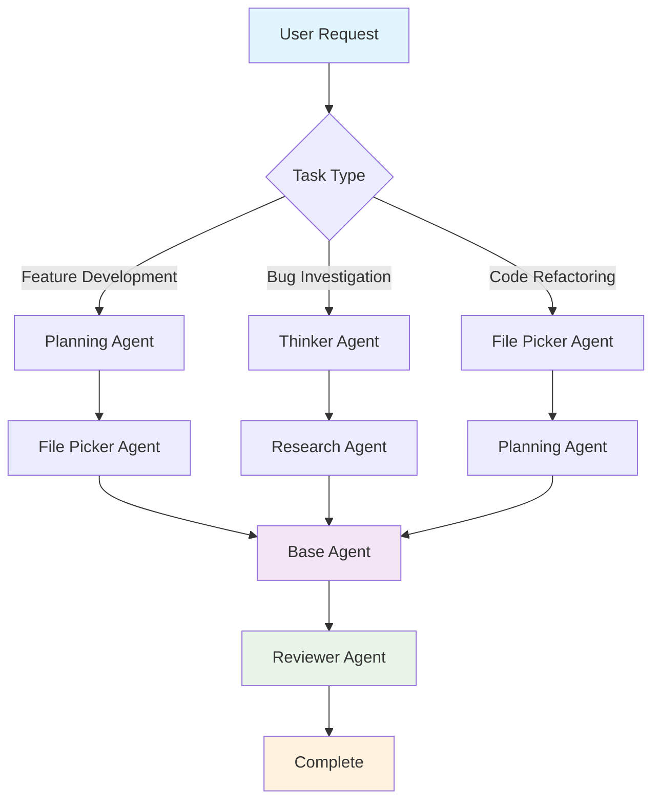

# Overview

## Why Multi-Agent Systems Work Better

Codebuff uses specialized agents that collaborate instead of one agent doing everything. Agents spawn other agents, share tools, and pass context between tasks. Here are some of the sub-agents Codebuff uses:

- **Code Generation** - Write clean, functional code
- **Review** - Catch bugs, security issues, style violations
- **Research** - Find documentation and examples
- **Planning** - Break down complex requirements
- **File Discovery** - Navigate large codebases

## What Makes Codebuff Agents Unique?

Codebuff agents can be **programmatically controlled** using TypeScript generator functions. You can write actual code to orchestrate complex workflows, make decisions based on file contents, and add in determinism as you see fit. Instead of hoping an LLM understands your instructions you can guarantee specific behavior.

## Built-in Agents

- `codebuff/base` - Main coding assistant
- `codebuff/reviewer` - Code review
- `codebuff/thinker` - Deep thinking
- `codebuff/researcher` - Research & docs
- `codebuff/planner` - Planning & architecture
- `codebuff/file-picker` - File discovery

## Agent Workflow

A typical call to Codebuff may result in the following flow:

### Example: Authentication System Refactoring

If you say "refactor this authentication system", Codebuff might break down the task into the following steps:

1. **File Picker** finds auth-related files
2. **Research** looks up best practices
3. **Planning** creates step-by-step plan
4. **Base** implements changes informed by the previous agents
5. **Reviewer** checks for security issues

### Agent Coordination

Agents coordinate through the `spawnerPrompt` field, which helps other agents understand when and why to spawn them. This creates intelligent workflows where:

- Specialized agents are spawned for specific tasks
- Each agent clearly describes its purpose and capabilities
- The system automatically matches tasks to the right agents

Agents can spawn other agents listed in their `spawnableAgents` field, creating a hierarchy of specialized helpers.

## Quick Start

1. **[Customize existing agents](/docs/agents#customizing-agents)** - Modify prompts and tools
2. **[Create new agents](/docs/agents#creating-new-agents)** - Build specialized functionality
3. **[Reference guide](/docs/agents#agent-reference)** - Complete field documentation
